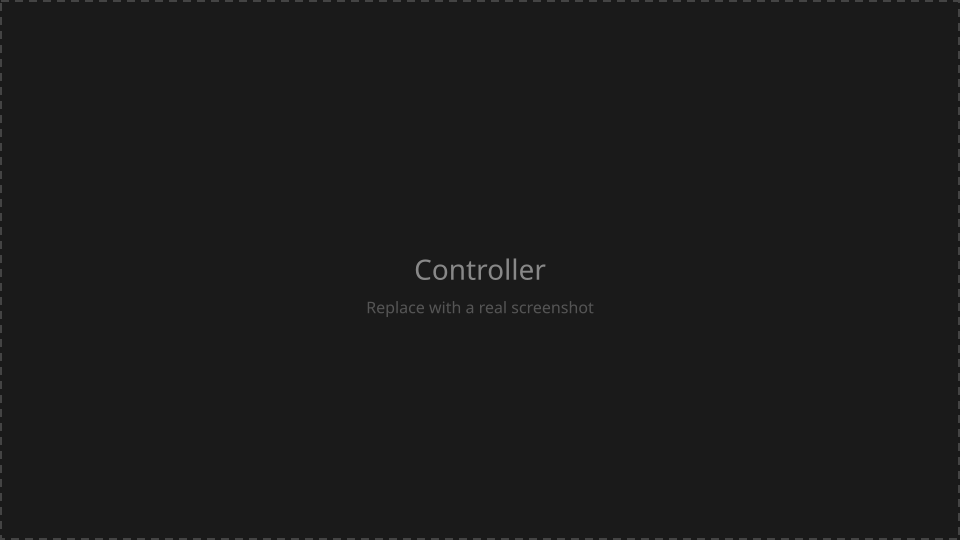
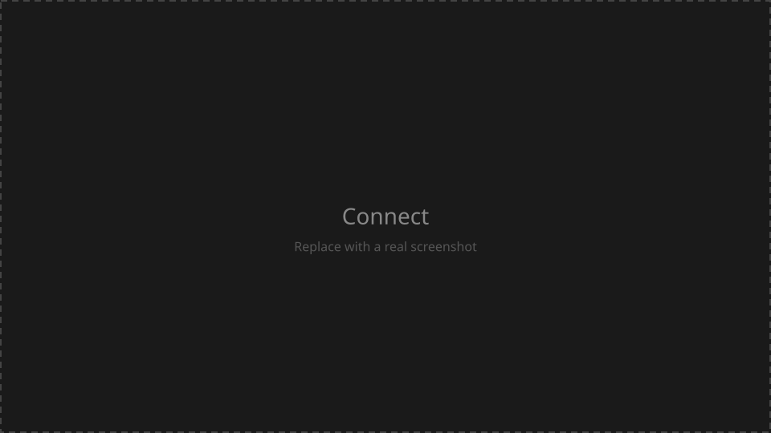
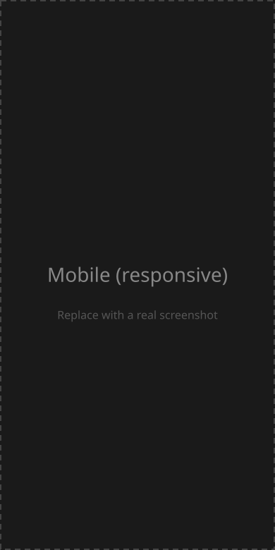

# GP Studio

## What is GP Studio?

GP Studio is an independent controller for Valeton GP-5 and GP-50 pedals.

I built it because I wanted a real desktop workflow — every control on screen at once, with instant connection over USB or Bluetooth.

The official app is at [gpstudio.patocorrenti.com](https://gpstudio.patocorrenti.com).

I put a lot of care into the small details; this app was built with a lot of ❤️.
Hopefully more people will join in and we can extend support to more models and platforms.

## Supported devices

- **Valeton GP-5** — USB and Bluetooth
- **Valeton GP-50** — USB and Bluetooth

## Features

- Quick connect (remembers your pedals and preferences) over USB or Bluetooth
- Full control of patches and modules at once, in real time
- Transparent GP-5 ↔ GP-50 compatibility — export presets from one model to the other
- Control the pedal footswitches from the app
- Prepared to be compiled as a desktop application

## Installation

### Web app

Use the official app at [gpstudio.patocorrenti.com](https://gpstudio.patocorrenti.com).

Tested in **Google Chrome**. USB and Bluetooth need a Chromium-based browser with Web MIDI / Web Bluetooth support.

### Desktop

Official desktop builds are not distributed yet. A [Tauri](https://tauri.app/) shell is in this repository and can be compiled locally (see [Development](#development)). Builds for Windows, macOS, and Linux are planned.

## Screenshots

Controller — full desktop workflow:



Connect — USB / Bluetooth:



Mobile layout (responsive; the app is desktop-first):



Replace these placeholders with real PNGs when ready (same filenames, or update the links above).

## Development

Requirements: Node.js and npm.

```bash
npm install
npm run dev
```

### Desktop shell (optional)

The [Tauri](https://tauri.app/) shell is not an official release. To run it locally you also need a Rust toolchain and the [Tauri prerequisites](https://tauri.app/start/prerequisites/) for your platform:

```bash
npm run tauri dev
```

## Contributing

Bug reports and contribution notes are in [CONTRIBUTING.md](CONTRIBUTING.md).

External code contributions are not open yet. Security issues: see [SECURITY.md](SECURITY.md).

## License

This project is licensed under the [MIT License](LICENSE).

Copyright (c) 2026 Patricio Correnti.

## Trademark notice

Valeton, GP-5, and GP-50 are trademarks of their respective owners. Use of these names is for identification only and does not imply any endorsement.

## Non-affiliation notice

GP Studio is an independent project. It is not affiliated with, endorsed by, or sponsored by Valeton.
