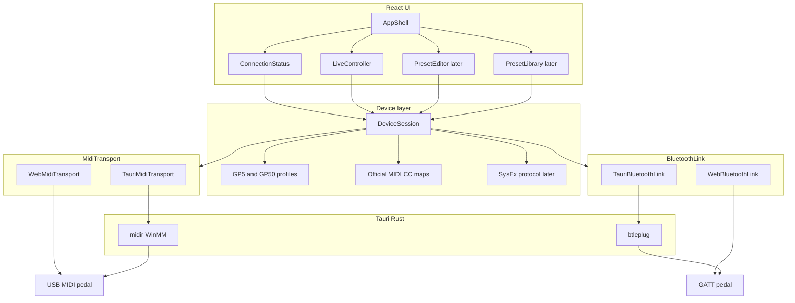

# Patone: web + Windows (Tauri) + OpenSpec

Plan acordado para Patone, editor/controlador de pedales Valeton GP-5 y GP-50.

El producto habla USB-MIDI con GP-5 y GP-50: fase 1 usa el MIDI CC oficial; editor SysEx y librería/IRs vienen después.

## Stack

- **UI:** Vite + React + TypeScript + Tailwind + shadcn (desde el scaffold)
- **Tema:** dark por default, light opcional (tokens / clase `dark` de shadcn). No es un change aparte: entra en `bootstrap-app`.
- **Shell nativo:** Tauri 2 (instalador Windows ahora; iOS/Android más adelante)
- **MIDI / link:** USB y Bluetooth son links distintos. USB-MIDI usa `MidiTransport` (tubo de bytes + discovery), no tipos `MIDIPort`
  - Fase 1, USB-MIDI: dos backends del mismo contrato USB
    - Browser: Web MIDI (`navigator.requestMIDIAccess`)
    - Desktop/mobile: Rust `midir` vía comandos/eventos Tauri (WebView2 **no** expone Web MIDI)
  - Un endpoint USB lleva `id`, `label`, `kind: usb-midi` y `suggestedModel` opcional
  - Bluetooth (servicio BLE-MIDI MMA) es otro backend, no un `kind` más del tubo MIDI:
    - Browser: Web Bluetooth
    - Desktop: Rust `btleplug` vía comandos Tauri (WebView2 **no** expone Web Bluetooth)
    - Contrato `BluetoothLink`: `discover` / `open` / `send` / `close`
    - Un endpoint Bluetooth lleva `id`, `label`, `kind: bluetooth` y `suggestedModel` opcional
- **Estado de dispositivo:** capa TypeScript compartida, independiente del transporte
- **Sin backend HTTP.** La app habla directo con el pedal

Electron queda descartado: más pesado y peor camino a mobile. El costo de Tauri es el doble backend USB-MIDI, que se aísla detrás de la interfaz.

## Arquitectura




La UI nunca llama MIDI crudo. `DeviceSession` conoce el modelo (GP-5 vs GP-50), traduce acciones a CC/SysEx, y el transporte solo envía/recibe bytes. Tres ejes, no mezclarlos:

- **Modelo:** GP-5 vs GP-50 (perfiles / CCs / UI)
- **Protocolo:** CC oficial ahora, SysEx después (cómo se escribe la acción)
- **Link:** USB vs Bluetooth (cómo llega el paquete). No son intercambiables.

USB es one-way y super fast: la app manda CC; el pedal no telemetra knobs ni módulos. Puede mandar dumps SysEx al cargar un patch; eso se loguea y se podrá aplicar después, pero no convierte USB en duplex.

Bluetooth es two-way y más lento. El pedal anuncia el servicio BLE-MIDI MMA y Patone escribe recall de patch (CC 0 envuelto en paquete BLE-MIDI) en esa característica I/O. Sigue siendo otro backend (`BluetoothLink`, no el tubo USB-MIDI), no un fork de `DeviceSession`. Controller, Editor y Library siguen en una sola sesión; `linkMode` (`usb` | `bluetooth`) es una máscara de capacidades (`liveFromPedal`, `commandToPedal`). Connect escanea y abre GATT. El encoder corre en `DeviceSession` y `BluetoothLink.send` escribe esos bytes; **no copiar** SysEx reverse-engineered de terceros. El Log inbound de Bluetooth y el resto de CCs (volumen, módulos) son changes después.

`MidiTransport` no es “listar puertos Web MIDI”. Es discovery + tubo USB-MIDI:

- `discover()` → endpoints (`id`, `label`, `kind: usb-midi`, `suggestedModel?`)
- `open(id)` / `send(bytes)` / `onMessage(bytes)` / `close()`

`BluetoothLink` es discovery + sesión GATT + tubo de bytes:

- `discover()` → endpoints (`id`, `label`, `kind: bluetooth`, `suggestedModel?`)
- `open(id)` / `send(bytes)` / `close()`

Web MIDI y `midir` son los dos backends USB. Web Bluetooth y `btleplug` son los dos backends GATT. Connect abre con tabs USB | Bluetooth: el usuario elige el método primero. La pestaña USB usa el tubo MIDI; la pestaña Bluetooth escanea pedales y conecta GATT. Phase 1 MIDI endpoints siguen `kind: usb-midi`.

Patch recall por Bluetooth ya es CC 0 envuelto en paquete BLE-MIDI. Si un comando futuro no habla CC, el gancho sigue siendo el encoder (CC vs SysEx), el mismo que necesita el editor USB.

Connect no es una pantalla: es estado de sesión global. El chrome lo muestra siempre (sin pedal: Connect) y el flujo de conexión ocurre en un modal. Controller es la home.

## Estructura de repo

Un solo app (no monorepo). OpenSpec vive en la raíz, al lado del código.

```text
patone/
  openspec/
    config.yaml
    specs/
    changes/
  .cursor/               # skills y commands OPSX (openspec init --tools cursor)
  src/
    app/                 # shell React: layout, routing, theme (dark default)
    features/
      connect/           # estado global + modal (no es una página)
      controller/        # home / fase 1
      editor/            # fase 2 (stub)
      library/           # fase 3 (stub)
    device/
      models.ts          # Gp5 | Gp50
      profiles/
      cc.ts              # maps oficiales
      session.ts
    midi/
      types.ts           # MidiTransport: endpoints + bytes (kind usb-midi)
      detect.ts          # elige backend USB web vs tauri
      web.ts
      tauri.ts
    bluetooth/
      types.ts           # BluetoothLink: endpoints + GATT open/send/close (kind bluetooth)
      detect.ts          # elige backend BLE web vs tauri
      web.ts
      tauri.ts
  src-tauri/             # Tauri 2 + midir + btleplug
  package.json
```

Perfiles de dispositivo (fase 1, CC oficial):

- **GP-5:** CC 0 patch, 7 volume, 22–25 bank/patch, 48–57 módulos, 58 tuner, 69 CTL
- **GP-50:** lo anterior + master/EXP/BPM/modo Patch|Stomp (CC 1, 11, 13, 17, 19, 21, 28)

Detección: el endpoint sugiere modelo por el nombre USB o el advertised name Bluetooth (Valeton suele aparecer como GP-5 / GP-50). Si hay duda o el nombre no encaja, el usuario confirma o corrige. No tratar el nombre como identidad de hardware.

## OpenSpec

Trabajo spec-driven desde el día 1. No dump de código sin change.

1. `git init` en este repo
2. Instalar CLI (`@fission-ai/openspec`) y `openspec init` con herramienta **Cursor**
3. Completar `openspec/config.yaml` con contexto: Tauri 2, React/TS, MIDI dual, GP-5/GP-50, fases
4. Cada feature = un change: `/opsx:propose` → review → `/opsx:apply` → `/opsx:archive`
5. El agente no prueba en el navegador a menos que el usuario lo pida explícitamente. Typecheck/lint sí; la UI la prueba el usuario.

Cambios previstos, en orden:

1. `bootstrap-app` — scaffold Tauri 2 + Vite/React/TS/Tailwind/shadcn, tema dark default, scripts `dev` / `tauri dev` / `build`
2. `midi-transport` — `MidiTransport` (endpoints + bytes, `kind: usb-midi`) + Web MIDI + comandos Rust `midi_list_ports` / `open` / `send` + eventos inbound. Sin BLE.
3. `device-connection` — detectar GP-5/GP-50, conectar, estado de sesión (control global + modal, no una ruta)
4. `live-controller` — patch, volumen, on/off de módulos, tuner (CC oficial)
5. Más adelante: `preset-editor` (SysEx), `preset-library`, IRs/NAM

Dominios de spec: `midi-transport`, `device-connection`, `live-controller`. El editor y la librería no se especifican hasta su change.

El SysEx de editor/IRs está reverse-engineered en proyectos ajenos (p.ej. editores WebMIDI existentes). **No copiar ese código.** Fase 1 usa solo el MIDI CC publicado en los manuals. Fase 2 se documenta en su propio design.md.

## Fase 1 — lo que se ve

Chrome siempre visible: nombre Patone, control de conexión a la izquierda, secciones Controller / Editor / Library y tema a la derecha. Controller es la home (`/`). Connect no es una sección: es estado global. Sin pedal el control dice Connect y abre un modal.

Modal de conexión: tabs USB y Bluetooth. USB pide permiso MIDI, lista endpoints, conecta, sugiere/confirma modelo, y se presenta como one-way y super fast. Bluetooth explica two-way y más lento, escanea pedales GATT, conecta, y sugiere/confirma modelo. Con Bluetooth conectado, Controller manda recall de patch por el encoder GATT (mismo selector 00–99 que USB). Qué muestra el control cuando hay pedal se define en `device-connection`.

Pantalla Controller: selector de patch 00–99, volumen, toggles NR/PRE/DST/NS/AMP/CAB/EQ/MOD/DLY/RVB, tuner. GP-50 además: master volume y modo Patch/Stomp.

Empaquetado Windows: `tauri build` → instalador NSIS/MSI. Web: `vite` en Chrome/Edge (localhost o HTTPS). Mobile queda fuera de estos cambios; la abstracción MIDI ya lo deja preparado.

## Fuera de alcance ahora

- App mobile Tauri
- Lectura/escritura de presets, rename, reorder
- Upload de IR / SnapTone / NAM
- Log inbound Bluetooth / aplicar `liveFromPedal` al snapshot
- Volumen, módulos, tuner y extras GP-50 por Bluetooth


## Roadmap

- [x] Init git + OpenSpec (Cursor) y completar `openspec/config.yaml` con el contexto del stack
- [x] Change OpenSpec `bootstrap-app`: Tauri 2 + Vite + React + TS + Tailwind + shadcn, dark default
- [x] Change `midi-transport`: interfaz `MidiTransport` (endpoints + bytes), Web MIDI y backend Tauri/midir (USB only)
- [x] Change `device-connection`: perfiles GP-5/GP-50, detección y sesión (control global + modal)
- [x] Change `link-modes`: tabs USB | Bluetooth, `linkMode` en la sesión
- [x] Change `bluetooth-connect`: scan/conectar GATT (sin encoder de patch)
- [x] Change `live-controller`: UI de patch 00–99 via MIDI CC oficial (USB)
- [x] Change `bluetooth-patch-control`: encoder de patch sobre GATT (mismo Controller que USB)