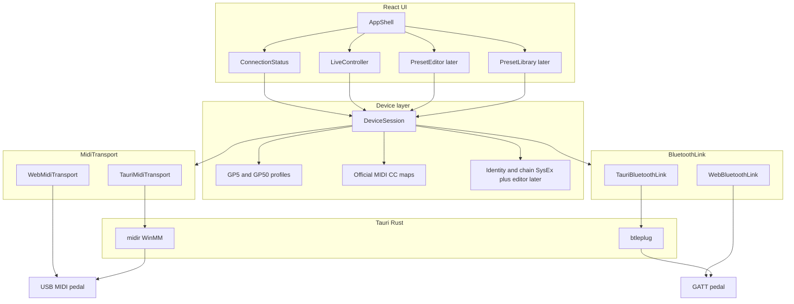

# Patone GP Studio: web + Windows (Tauri) + OpenSpec

Agreed plan for Patone GP Studio, an editor/controller for Valeton GP-5 and GP-50 pedals.

The product talks USB-MIDI and Bluetooth to GP-5 and GP-50: patch recall and module on/off (CC 48–57) use official MIDI CC; an identity SysEx subset (current patch + names), the current-patch audio chain (order + on/off + factory model and knobs for the ten effect slots), and the pedal's IR-name dump are requested on connect. The IR-name dump is device-global and does not block identity or chain loading. The twenty onboard user IR slots are CAB models (select and VOL use the existing model/control SETs). Movable-module order, the current-slot model/knob, and Save / rename / duplicate of the current patch are also written (Patone GP Studio SysEx, path `01 01 04`, CRC-8 + nibble-expand; not a full dump and not the Editor route). Downloading the current patch as a Valeton `.prst` for the connected pedal, and loading that file into the working patch, are in scope (GP-50 file → GP-50 session, GP-5 file → GP-5 session; working-buffer writes; Save remains store `114a`; no extra recall and no cross-model conversion). Library `.prst` import, conversion between models, and IR / NAM **file upload** come later.

## Stack

- **UI:** Vite + React + TypeScript + Tailwind + shadcn (from the scaffold)
- **Theme:** dark by default, light optional (shadcn tokens / `dark` class). Not a separate change: it landed in `bootstrap-app`.
- **Native shell:** Tauri 2 (Windows installer now; iOS/Android later)
- **MIDI / link:** USB and Bluetooth are different links. USB-MIDI uses `MidiTransport` (byte pipe + discovery), not `MIDIPort` types
  - Phase 1, USB-MIDI: two backends of the same USB contract
    - Browser: Web MIDI (`navigator.requestMIDIAccess`)
    - Desktop/mobile: Rust `midir` via Tauri commands/events (WebView2 does **not** expose Web MIDI)
  - A USB endpoint has `id`, `label`, `kind: usb-midi`, and optional `suggestedModel`
  - Bluetooth (MMA BLE-MIDI service) is another backend, not an extra `kind` on the MIDI pipe:
    - Browser: Web Bluetooth
    - Desktop: Rust `btleplug` via Tauri commands (WebView2 does **not** expose Web Bluetooth)
    - `BluetoothLink` contract: `discover` / `open` / `send` / `subscribe` / `close`
    - A Bluetooth endpoint has `id`, `label`, `kind: bluetooth`, and optional `suggestedModel`
- **Device state:** shared TypeScript layer, independent of transport
- **No HTTP backend.** The app talks to the pedal directly

Electron is rejected: heavier, worse mobile path. Tauri’s cost is the dual USB-MIDI backend, isolated behind the interface.

## Architecture




The UI never calls raw MIDI. `DeviceSession` knows the model (GP-5 vs GP-50), translates actions to CC/SysEx, and the transport only sends/receives bytes. Three axes; do not mix them:

- **Model:** GP-5 vs GP-50 (profiles / CCs / UI)
- **Protocol:** official CC for recall and module on/off (48–57); identity SysEx (index + names) and current-chain SysEx (order + on/off + model and knobs for the ten effects) on connect and on patch change; IR-name read once per connect (user-IR CAB slots, dumped names over `User IR 01`…`20`); Patone GP Studio SysEx writes for order, model, a control, and the current-patch store (Save / rename / duplicate; parameter-write `01 01 04`, not live notify `01 02 04`); local download to a Valeton `.prst` of the connected model and load of that file into the working patch (writes; Save is store `114a`; no cross-model conversion); Bluetooth applies live chain-order and live model/control SysEx (pedal→app); library and IR / NAM file upload later
- **Link:** USB vs Bluetooth (how the packet arrives). They are not interchangeable.

USB is one-way and super fast for knobs and modules: the app sends CC (patch and module on/off); the pedal does not telemetry those controls. It can still answer requested SysEx dumps (and on patch load). That does not make USB duplex for live controls.

Bluetooth is two-way and slower. The pedal advertises the MMA BLE-MIDI service and Patone GP Studio writes patch recall (CC 0 wrapped as BLE-MIDI), module on/off (CC 48–57), identity and chain requests, the current-chain order write, current-patch model/control SETs, and the store SET (Save / rename / duplicate) on that I/O characteristic. It is still another backend (`BluetoothLink`, not the USB-MIDI pipe), not a fork of `DeviceSession`. Controller, Editor, and Library stay on one session; `linkMode` (`usb` | `bluetooth`) is a capability mask (`liveFromPedal`, `commandToPedal`). Connect scans and opens GATT. The encoder runs in `DeviceSession` and `BluetoothLink.send` writes those bytes; **do not paste** third-party JavaScript into `src/`. The local copy in `reference/` **may be read** (`docs/protocol-references.md`). Log shows inbound MIDI from USB and Bluetooth (unwrapped BLE-MIDI framing) only while that screen is open and does not apply traffic. `DeviceSession` does apply patch identity (index and names) and the current chain (order + on/off + model and control values) to the snapshot. It also requests the IR-name dump once per connect and keeps those names across later preset dumps. On Bluetooth (`liveFromPedal`) it also applies inbound module on/off: live SysEx (command 09), EXP (command 02), and the same origin when a Stomp-mode footswitch changes modules; live chain-order SysEx (command 04, path `01 02 04`); and live model (command 07) and live control (command 08) SysEx for the ten effects. On/off and order do not clobber model/values; live model/control do update them. Volume, tuner, and Patch/Stomp control come later. USB does not apply those inbound reports (not live-module, not live chain-order, not live parameters): USB stays one-way for that telemetry.

`MidiTransport` is not “list Web MIDI ports”. It is discovery + a USB-MIDI byte pipe:

- `discover()` → endpoints (`id`, `label`, `kind: usb-midi`, `suggestedModel?`)
- `open(id)` / `send(bytes)` / `onMessage(bytes)` / `close()`, plus a disconnect signal if the USB port drops

`BluetoothLink` is discovery + a GATT session + a byte pipe:

- `discover()` → endpoints (`id`, `label`, `kind: bluetooth`, `suggestedModel?`)
- `open(id)` / `send(bytes)` / `subscribe(handler)` / `close()`, plus a disconnect signal if GATT drops

Web MIDI and `midir` are the two USB backends. Web Bluetooth and `btleplug` are the two GATT backends. Connect opens with USB | Bluetooth tabs: the user picks the method first. The USB tab uses the MIDI pipe; the Bluetooth tab scans pedals and connects GATT. Phase 1 MIDI endpoints stay `kind: usb-midi`.

Bluetooth patch recall is already CC 0 wrapped as a BLE-MIDI packet. Module on/off is CC 48–57 wrapped the same way. The current-patch order, model, control, and store writes are Patone GP Studio SysEx wrapped the same way (one GATT write `80 80` + `F0`…`F7`; do not split SETs of that family into 20-byte packets). If a future command does not speak CC, the hook is still the encoder (CC vs SysEx), the same one the USB editor needs.

Connect is not a screen: it is global session state. Chrome always shows it (no pedal: Connect) and the connection flow happens in a modal. Controller is home. The shell hosts global English toasts (shadcn Sonner, `toast.promise`: spinner then success or error) for connect, disconnect, and Save / rename / duplicate / upload of the current patch. A successful-upload toast may offer Save; it does not store on its own. On disconnect (button or lost link) the Connect modal closes.

## Repo layout

Single app (not a monorepo). OpenSpec lives at the root, next to the code.

```text
patone/
  openspec/
    config.yaml
    specs/
    changes/
  .cursor/               # OPSX skills and commands (openspec init --tools cursor)
  src/
    app/                 # React shell: layout, routing, theme (dark default)
    components/
      ui/                # shadcn primitives (Button, Dialog, Tabs, …)
      main-menu.tsx      # shell chrome; not pedal domain
      theme-toggle.tsx
    features/
      connect/           # global state + modal (not a page); Connect UI lives here
      controller/        # home / phase 1; Controller UI lives here
      editor/            # phase 2 (stub)
      library/           # phase 3 (stub)
      about/             # About GP Studio (no pedal)
    device/
      models.ts          # Gp5 | Gp50
      profiles/
      cc.ts              # official maps
      session/           # DeviceSession façade; UI imports @/device/session
        index.ts
        device-session.ts  # orchestrator (connect, sync, public commands)
        working-patch.ts
        inbound.ts         # Bluetooth live follow
        writes.ts          # throttled SETs
        patch-io.ts        # .prst upload plan / download overlay
        checks.ts
    midi/
      types.ts           # MidiTransport: endpoints + bytes (kind usb-midi)
      detect.ts          # picks USB web vs tauri backend
      web.ts
      tauri.ts
    bluetooth/
      types.ts           # BluetoothLink: endpoints + GATT open/send/subscribe/close (kind bluetooth)
      detect.ts          # picks BLE web vs tauri backend
      web.ts
      tauri.ts
  src-tauri/             # Tauri 2 + midir + btleplug
  reference/             # local copy of the GP-50 editor (read; do not paste into src/)
  package.json
```

Feature UI lives in `src/features/<feature>/` (sibling files; no `src/components/connection/` or other domain folders under `src/components/`). Extract when a module mixes orchestration with two or more screens, the same JSX is pasted twice, or inner functions already read as components and the parent is hard to navigate. Do not extract a lone button or “just in case”. Promote a widget to `src/components/` only when a second feature imports it. A later split of a large file (Editor, Library) is Direct-lane if the rule does not change.

`DeviceSession` is the single public façade under `src/device/session/` (one session for USB and Bluetooth). Live inbound follow, throttled command-out writes, and current-patch file I/O are siblings in that folder. UI, Connect, and Controller import only `@/device/session`. Codecs stay in `src/device/*.ts`. Extract a new sibling when adding an inbound family, a throttled write family, or a file-I/O planner; do not extract a lone helper or a second session per link. A later oversized `device-session.ts` is Direct-lane if this rule does not change.

Device profiles (phase 1, official CC):

- **GP-5:** CC 0 patch, 7 volume, 22–25 bank/patch, 48–57 modules, 58 tuner, 69 CTL
- **GP-50:** the above + master/EXP (CC 1, 11, 13), unused relative steps (CC 17, 19, 21), Patch|Stomp mode (CC 28), and absolute tempo (CC 73 + CC 74)

Detection: the endpoint suggests a model from the USB name or the Bluetooth advertised name (Valeton usually appears as GP-5 / GP-50). If it is ambiguous or the name does not match, the user confirms or corrects. Do not treat the name as hardware identity.

## OpenSpec

Specs in `openspec/specs/` are the durable behavior contract. A change is not required for every task.

**Change lane** — new capability, new or contested behavior, architecture, or anything that should be agreed before coding. `/opsx-propose` → review → `/opsx-apply` → `/opsx-archive`. `design.md` may be skipped when there is no cross-cutting work or ambiguity. `skip_specs: true` only when behavior does not change (refactor, tooling, docs).

**Direct lane** — bugfix, copy, UI polish, internal refactor, or Purpose/typo fixes in specs. Implement, then in the same work update whatever must persist: `openspec/specs/<capability>/spec.md` if observable behavior changed; this file if the agreed plan changed; the `context:` field in `openspec/config.yaml` if an agent constraint changed. Do not create a change, do not write `ADDED`/`MODIFIED`/`REMOVED` deltas (that is change format, not main-spec format), do not archive. If a spec was touched, validate with `openspec validate --specs`.

Rule of thumb: if a user or system could notice a difference and that difference is not in the spec, update the spec. If nothing observable changed, do not invent a requirement or a change. If the lane is unclear, ask. Do not default to Change out of habit.

The agent does not test in the browser unless the user explicitly asks. Typecheck/lint is fine; the user tests the UI.

Planned changes, in order:

1. `bootstrap-app` — scaffold Tauri 2 + Vite/React/TS/Tailwind/shadcn, dark-default theme, scripts `dev` / `tauri dev` / `build`
2. `midi-transport` — `MidiTransport` (endpoints + bytes, `kind: usb-midi`) + Web MIDI + Rust commands `midi_list_ports` / `open` / `send` + inbound events. No BLE.
3. `device-connection` — detect GP-5/GP-50, connect, session state (global control + modal, not a route)
4. `live-controller` — patch, volume, module on/off, tuner (official CC)
5. Later: `preset-editor` (SysEx), `preset-library`, IR / NAM file upload

Spec domains: `midi-transport`, `device-connection`, `live-controller`, `bluetooth-link`, `inbound-log`. Editor and library are not specified until their own change.

Library/IR SysEx is reverse-engineered in third-party projects. **Do not paste that JavaScript into `src/`.** The copy in `reference/` is read to understand the envelope (CRC-8 + nibble-expand, path `01 01 04` vs notify `01 02 04`). The identity codec, the chain codec (order + on/off + model and knobs for the ten effects), the IR-name request and fragment decoder, the order/model/control write SETs, and the current-patch store SET (`114a`) are owned by Patone GP Studio. Download builds a Valeton `.prst` for the connected model (header + CRC-8 ATM + dump); upload is the inverse onto the working patch (buffer writes; Save is store `114a`, not a dump SET). Patch-bar volume is official CC 7 and GP-50 tempo is official CC 73 then CC 74; family `1142` stays the upload path for those words. Do not paste the `reference/` builder or convert between GP-5 and GP-50. Library import stays later. Index: `docs/protocol-references.md`.

## Phase 1 — what is visible

Chrome always visible: GP Studio name, connection control on the left, Pedal / Log / About navigation and theme on the right. Controller is home (`/`). Connect is not a section: it is global state. With no pedal the control reads Connect and opens a modal. Editor and Library remain stub routes, not in the main menu.

Connection modal: USB and Bluetooth tabs. USB asks for MIDI permission, lists endpoints, connects, suggests/confirms model, and presents as one-way and super fast. Bluetooth explains two-way and slower, scans GATT pedals, connects, and suggests/confirms model. With Bluetooth connected, Controller sends patch recall through the GATT encoder (same 00–99 selector as USB). What the control shows when a pedal is connected is defined in `device-connection`.

Controller screen: on connect it may show loading while identity and the audio chain sync; then the patch bar (previous / 00–99 selector with names if they arrived / next, plus Reload, Save, rename, duplicate, download, and upload) and the current-patch chain (10 slots on GP-5, 11 on GP-50 with EXP at the end; the ten effects toggle via CC 48–57; GP-50 EXP via CC 13 on Bluetooth and via captured SysEx on USB). Reload sits immediately left of Save: an icon with an English tooltip that re-requests the current-preset dump and does not send patch recall. After a user or pedal patch change applies its dump, one confirmation dump is requested without the busy overlay: a matching chain is left as shown, and a different chain replaces the screen and the baseline only while the working patch is still unmodified. Save comes before rename: it stays disabled while the working patch matches the loaded or stored baseline, and enables with emerald styling when it differs. If there are unsaved changes, previous / selector / next show an English warning tooltip and do not block the patch change. Below that row, a panel for each enabled effect with a known model and knobs, in two columns when width allows (model select if that kind has more than one model; CAB includes the twenty user IR slots, labeled with dumped names or `User IR 01`…`User IR 20`; catalog sliders/toggles; EXP has no panel). The slider number follows the drag; the control SET is coalesced (throttle ~80 ms and flush on release) so BLE-MIDI is not flooded. Movable modules (NR, PRE, MOD, DLY, RVB) reorder by drag-and-drop on that same row (USB and Bluetooth) and show a three-dot grip; DST, NS, AMP, CAB, and EQ are not draggable and stay contiguous in that order (nothing in between); EXP is not draggable either. On Bluetooth, if the user reorders, changes a model, or turns a knob on the pedal, Controller follows those reports; USB ignores that telemetry. If NS (SnapTone) is on, AMP and CAB are marked bypassed with a prohibition overlay; their on/off is not rewritten and their panels are hidden. The same patch bar shows Volume (CC 7, 0–100) on GP-5 and GP-50, and BPM (CC 73 then CC 74, 40–260) on GP-50 only. Both stay disabled until the current-preset dump supplies a value, then edit through the session on USB and Bluetooth (throttle ~80 ms, flush on release). Inbound CC 7, CC 73, and CC 74 are not applied. On Bluetooth, a live patch-volume SysEx notify updates the Volume control (and `modified` when it differs from the baseline); USB ignores that notify. On GP-50, the chrome next to the connection status offers a Global control (gear icon; not a route) that opens a Global settings modal: master volume first, then input level, No CAB, REC / BT REC / monitor levels, REC mode L/R, and Patch | Stomp (CC 28). Edits apply immediately and do not mark the working patch `modified`. The session requests the GP-50 globals dump once per connect after the first current-preset dump (does not block sync). Bluetooth returns one SysEx (`00 02`); USB returns fragments (`00 08` / `00 09`, lengths 48 / 20–22) that the session assembles. Field offsets follow the reference editors (USB payload = Bluetooth absolute − 9; No CAB is not the editor’s buggy `data[64]`). Bluetooth live global reports and CC 1 / CC 28 also update the snapshot. GP-5 does not send that ask and has no Global control. Tuner stays later. The snapshot compares the chain, patch volume, and on GP-50 patch BPM against an in-memory copy of the last dump or Save/rename of the current slot (`modified`); it clears when those values are restored, on Save/rename, on patch change, or on disconnect. No dialog on patch change and no Modified label on the bar.

Log screen: inbound MIDI from USB or Bluetooth only while it is open. It does not apply that traffic to the snapshot. The session may apply patch identity, chain dumps, and, on Bluetooth, live module on/off SysEx (including a Stomp footswitch), live chain-order SysEx, and live model/control SysEx separately.

About screen: titled About GP Studio; English copy describing GP Studio as an independent controller for Valeton GP-5 and GP-50; subscribe-for-updates and report-a-bug form links before What's next; What's next and a Changelog for the current version; reachable from the main menu after Log and from Pato Correnti in the footer; web document title GP Studio | About while open (home restores GP Studio); does not require a pedal and does not send MIDI.

Windows packaging: `tauri build` → NSIS/MSI installer. Web: `vite` in Chrome/Edge (localhost or HTTPS). Mobile is out of these changes; the MIDI abstraction already leaves that path open.

## Out of scope for now

- Tauri mobile app
- Preset-library read/write, Library `.prst` import, library reorder (Save / rename / duplicate of the current patch, exporting the connected model’s `.prst`, and loading that file into the working patch are in scope; not the Library route, not GP-5/GP-50 conversion, not a dump SET)
- IR / SnapTone / NAM file upload (IR-name read and user-IR CAB select are in scope)
- Applying inbound volume, BPM, tuner, or other CCs that are not module on/off to the snapshot while the patch stays the same. Bluetooth live patch-volume SysEx, live-module / Stomp footswitch, live chain-order, live model/control for the ten effects, and live global reports (including CC 1 / CC 28 for master and Patch | Stomp) are in scope. USB does not apply live parameters.
- Treating USB as duplex for live controls, or applying USB inbound live-module / Stomp / live chain-order / live globals
- Tuner and the unused relative steps (CC 17, CC 19, CC 21) over either link. Patch volume (CC 7), GP-50 BPM (CC 73/74), GP-50 master volume (CC 1), and GP-50 Patch | Stomp (CC 28) are sent on USB and Bluetooth. GP-50 global SysEx rows (input / No CAB / REC / BT / monitor / REC mode) use the parameter-write family; GP-5 globals stay out until a capture locks them.
- Pedal GLOBAL menu rows with no MIDI path: EXP calibrate, analog/DSP bypass, EXP/FS jack assign, display sleep/brightness, MIDI input source/channels, Auto CAB match, language, factory reset, About, and GP-5 footswitch modes `0-99` / `0-9` / `A-Z` / `CTL` / `Tuner`
- Pasting JavaScript from `reference/` or other third-party editors into `src/`
- Editing stomp assignment (which modules each footswitch toggles). GP-50 decode is locked; the write was not accepted by the pedal. Change `stomp-assignment` is paused; lab in `openspec/changes/stomp-assignment/`


## Roadmap

- [x] Init git + OpenSpec (Cursor) and fill `openspec/config.yaml` with stack context
- [x] OpenSpec change `bootstrap-app`: Tauri 2 + Vite + React + TS + Tailwind + shadcn, dark default
- [x] Change `midi-transport`: `MidiTransport` interface (endpoints + bytes), Web MIDI and Tauri/midir backend (USB only)
- [x] Change `device-connection`: GP-5/GP-50 profiles, detection, and session (global control + modal)
- [x] Change `link-modes`: USB | Bluetooth tabs, `linkMode` on the session
- [x] Change `bluetooth-connect`: GATT scan/connect (no patch encoder)
- [x] Change `live-controller`: patch 00–99 UI via official MIDI CC (USB)
- [x] Change `bluetooth-patch-control`: patch encoder over GATT (same Controller as USB)
- [x] Change `inbound-log`: inbound USB + Bluetooth Log only while the Log page is open
- [x] Change `patch-sync`: initial identity (current patch + names) USB and Bluetooth
- [x] Change `audio-chain`: current-patch chain dump (order + on/off) and draw it on Controller
- [x] Change `chain-on-off`: module on/off (CC 48–57); Bluetooth applies inbound; USB only sends
- [x] Change `stomp-footswitch-chain`: Stomp footswitch follows on/off on Bluetooth (`liveFromPedal`); USB ignores those reports
- [x] Change `chain-reorder`: drag-and-drop of movable modules (NR, PRE, MOD, DLY, RVB); write SET `01 01 04` + CRC-8 (USB and Bluetooth); Bluetooth applies inbound live chain-order `01 02 04`; USB ignores those reports
- [x] Change `chain-slot-controls`: factory catalog, dump of model + knobs for the ten effects, Controller panels, SET `1147`/`1148`
- [x] Change `patch-save`: Save / rename / duplicate of the current patch (SET `114a`) and dump download (USB and Bluetooth)
- [x] Change `prst-download`: that download writes a Valeton `.prst` for the connected pedal (GP-50 → GP-50, GP-5 → GP-5; no cross-model conversion)
- [x] Change `prst-upload`: load a `.prst` of the connected model into the working patch (GP-50 → GP-50, GP-5 → GP-5; writes; Save is store `114a`; no extra recall and no cross-model conversion)
- [x] Change `patch-modified-state`: `modified` on the snapshot; Save disabled until the working patch differs from the baseline, then emerald (clears on Save / rename / restore / patch change / disconnect)
- [x] Change `toast-feedback`: global English toasts (Sonner promise) for connect/disconnect and Save/rename/duplicate/upload; the upload toast offers Save; disconnect closes the modal
- [ ] Change `stomp-assignment` (**paused 2026-09-18**): read/edit which modules each stomp assigns. GP-50 decode locked; SET not accepted. Lab: `openspec/changes/stomp-assignment/`
