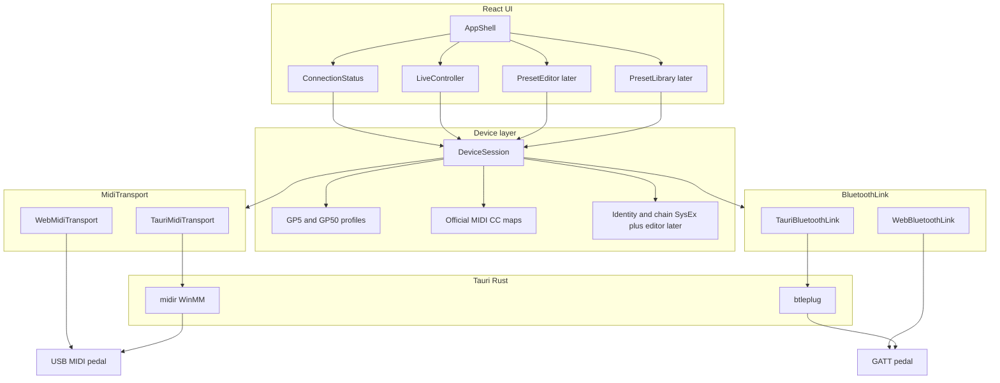

# Patone: web + Windows (Tauri) + OpenSpec

Plan acordado para Patone, editor/controlador de pedales Valeton GP-5 y GP-50.

El producto habla USB-MIDI y Bluetooth con GP-5 y GP-50: recall de patch y on/off de módulos (CC 48–57) usan el MIDI CC oficial; un subset SysEx de identidad (patch actual + nombres) y de la cadena de audio del patch actual (orden + on/off + modelo de fábrica y knobs de los diez efectos) se pide al conectar. El orden de módulos móviles, el modelo/knob del slot actual y guardar / renombrar / duplicar el patch actual también se escriben (SysEx Patone, path `01 01 04`, CRC-8 + nibble-expand; no un dump completo ni la ruta Editor). Descargar el patch actual a un `.prst` Valeton del pedal conectado, y precargar ese archivo en el patch de trabajo, están en alcance (GP-50 archivo → sesión GP-50, GP-5 archivo → sesión GP-5; writes del buffer de trabajo; Save sigue siendo el store `114a`; sin recall extra ni conversión cruzada). Import de `.prst` en Library, conversión entre modelos, IRs y NAM vienen después.

## Stack

- **UI:** Vite + React + TypeScript + Tailwind + shadcn (desde el scaffold)
- **Tema:** dark por default, light opcional (tokens / clase `dark` de shadcn). No es un change aparte: entra en `bootstrap-app`.
- **Shell nativo:** Tauri 2 (instalador Windows ahora; iOS/Android más adelante)
- **MIDI / link:** USB y Bluetooth son links distintos. USB-MIDI usa `MidiTransport` (tubo de bytes + discovery), no tipos `MIDIPort`
  - Fase 1, USB-MIDI: dos backends del mismo contrato USB
    - Browser: Web MIDI (`navigator.requestMIDIAccess`)
    - Desktop/mobile: Rust `midir` vía comandos/eventos Tauri (WebView2 **no** expone Web MIDI)
  - Un endpoint USB lleva `id`, `label`, `kind: usb-midi` y `suggestedModel` opcional
  - Bluetooth (servicio BLE-MIDI MMA) es otro backend, no un `kind` más del tubo MIDI:
    - Browser: Web Bluetooth
    - Desktop: Rust `btleplug` vía comandos Tauri (WebView2 **no** expone Web Bluetooth)
    - Contrato `BluetoothLink`: `discover` / `open` / `send` / `subscribe` / `close`
    - Un endpoint Bluetooth lleva `id`, `label`, `kind: bluetooth` y `suggestedModel` opcional
- **Estado de dispositivo:** capa TypeScript compartida, independiente del transporte
- **Sin backend HTTP.** La app habla directo con el pedal

Electron queda descartado: más pesado y peor camino a mobile. El costo de Tauri es el doble backend USB-MIDI, que se aísla detrás de la interfaz.

## Arquitectura




La UI nunca llama MIDI crudo. `DeviceSession` conoce el modelo (GP-5 vs GP-50), traduce acciones a CC/SysEx, y el transporte solo envía/recibe bytes. Tres ejes, no mezclarlos:

- **Modelo:** GP-5 vs GP-50 (perfiles / CCs / UI)
- **Protocolo:** CC oficial para recall y on/off de módulos (48–57); SysEx de identidad (índice + nombres) y de la cadena actual (orden + on/off + modelo y knobs de los diez efectos) al conectar y al cambiar de patch; escritura SysEx Patone del orden, del modelo, de un control y del store del patch actual (Save / rename / duplicate; parameter-write `01 01 04`, no el notify live `01 02 04`); descarga local a `.prst` Valeton del modelo conectado y precarga del mismo archivo en el patch de trabajo (writes; Save es el store `114a`; sin conversión cruzada); Bluetooth aplica SysEx live de orden de cadena y de modelo/control (pedal→app); librería / IRs / NAM después
- **Link:** USB vs Bluetooth (cómo llega el paquete). No son intercambiables.

USB es one-way y super fast para knobs y módulos: la app manda CC (patch y on/off de módulos); el pedal no telemetra esos controles. Sí puede responder dumps SysEx pedidos (y al cargar un patch). Eso no convierte USB en duplex de live controls.

Bluetooth es two-way y más lento. El pedal anuncia el servicio BLE-MIDI MMA y Patone escribe recall de patch (CC 0 envuelto en paquete BLE-MIDI), on/off de módulos (CC 48–57), las peticiones de identidad y de cadena, el write de orden de la cadena actual, los SET de modelo/control del patch actual y el SET de store (Save / rename / duplicate) en esa característica I/O. Sigue siendo otro backend (`BluetoothLink`, no el tubo USB-MIDI), no un fork de `DeviceSession`. Controller, Editor y Library siguen en una sola sesión; `linkMode` (`usb` | `bluetooth`) es una máscara de capacidades (`liveFromPedal`, `commandToPedal`). Connect escanea y abre GATT. El encoder corre en `DeviceSession` y `BluetoothLink.send` escribe esos bytes; **no pegar** JavaScript de terceros en `src/`. Se **puede leer** la copia local en `reference/` (`docs/protocol-references.md`). El Log muestra MIDI inbound de USB y Bluetooth (framing BLE-MIDI unwrappeado) solo mientras esa pantalla está abierta y no aplica tráfico. `DeviceSession` sí aplica identidad de patch (índice y nombres) y la cadena actual (orden + on/off + modelo y valores de control) al snapshot. En Bluetooth (`liveFromPedal`) también aplica inbound de on/off de módulos: SysEx live (comando 09), EXP (comando 02) y el mismo origen cuando un footswitch en modo Stomp cambia módulos; SysEx live de orden de cadena (comando 04, path `01 02 04`); y SysEx live de modelo (comando 07) y de control (comando 08) de los diez efectos. On/off y orden no pisan modelo/valores; modelo/control live sí los actualizan. Volumen, tuner y control Patch/Stomp siguen después. USB no aplica esos reportes inbound (ni live-module ni live chain-order ni parámetros live): USB sigue one-way para esa telemetría.

`MidiTransport` no es “listar puertos Web MIDI”. Es discovery + tubo USB-MIDI:

- `discover()` → endpoints (`id`, `label`, `kind: usb-midi`, `suggestedModel?`)
- `open(id)` / `send(bytes)` / `onMessage(bytes)` / `close()`, plus a disconnect signal if the USB port drops

`BluetoothLink` es discovery + sesión GATT + tubo de bytes:

- `discover()` → endpoints (`id`, `label`, `kind: bluetooth`, `suggestedModel?`)
- `open(id)` / `send(bytes)` / `subscribe(handler)` / `close()`, plus a disconnect signal if GATT drops

Web MIDI y `midir` son los dos backends USB. Web Bluetooth y `btleplug` son los dos backends GATT. Connect abre con tabs USB | Bluetooth: el usuario elige el método primero. La pestaña USB usa el tubo MIDI; la pestaña Bluetooth escanea pedales y conecta GATT. Phase 1 MIDI endpoints siguen `kind: usb-midi`.

Patch recall por Bluetooth ya es CC 0 envuelto en paquete BLE-MIDI. On/off de módulos es CC 48–57 envuelto igual. El write de orden, de modelo, de un control y del store del patch actual es SysEx Patone envuelto igual (un GATT write `80 80` + `F0`…`F7`; no partir SET de esa familia en paquetes de 20). Si un comando futuro no habla CC, el gancho sigue siendo el encoder (CC vs SysEx), el mismo que necesita el editor USB.

Connect no es una pantalla: es estado de sesión global. El chrome lo muestra siempre (sin pedal: Connect) y el flujo de conexión ocurre en un modal. Controller es la home. El shell monta toasts globales en English (shadcn Sonner, `toast.promise`: spinner y luego éxito o error) para conectar, desconectar, y Save / rename / duplicate / upload del patch actual. El toast de upload exitoso puede ofrecer Save; no guarda solo. Al desconectar (botón o link perdido) el modal de Connect se cierra.

## Estructura de repo

Un solo app (no monorepo). OpenSpec vive en la raíz, al lado del código.

```text
patone/
  openspec/
    config.yaml
    specs/
    changes/
  .cursor/               # skills y commands OPSX (openspec init --tools cursor)
  src/
    app/                 # shell React: layout, routing, theme (dark default)
    components/
      ui/                # primitivos shadcn (Button, Dialog, Tabs, …)
      main-menu.tsx      # chrome del shell; no dominio de pedal
      theme-toggle.tsx
    features/
      connect/           # estado global + modal (no es una página); UI de Connect acá
      controller/        # home / fase 1; UI de Controller acá
      editor/            # fase 2 (stub)
      library/           # fase 3 (stub)
    device/
      models.ts          # Gp5 | Gp50
      profiles/
      cc.ts              # maps oficiales
      session.ts
    midi/
      types.ts           # MidiTransport: endpoints + bytes (kind usb-midi)
      detect.ts          # elige backend USB web vs tauri
      web.ts
      tauri.ts
    bluetooth/
      types.ts           # BluetoothLink: endpoints + GATT open/send/subscribe/close (kind bluetooth)
      detect.ts          # elige backend BLE web vs tauri
      web.ts
      tauri.ts
  src-tauri/             # Tauri 2 + midir + btleplug
  reference/             # copia local del editor GP-50 (leer, no pegar en src/)
  package.json
```

La UI de un feature vive en `src/features/<feature>/` (archivos hermanos; sin `src/components/connection/` ni otras carpetas de dominio bajo `src/components/`). Extraer cuando un módulo mezcla orquestación con dos o más pantallas, el mismo JSX está pegado dos veces, o funciones internas ya se leen como componentes y el padre es difícil de navegar. No extraer un botón suelto ni “por las dudas”. Subir un widget a `src/components/` solo cuando un segundo feature lo importa. Un split posterior de un archivo grande (Editor, Library) es carril Directo si la regla no cambia.

Perfiles de dispositivo (fase 1, CC oficial):

- **GP-5:** CC 0 patch, 7 volume, 22–25 bank/patch, 48–57 módulos, 58 tuner, 69 CTL
- **GP-50:** lo anterior + master/EXP/BPM/modo Patch|Stomp (CC 1, 11, 13, 17, 19, 21, 28)

Detección: el endpoint sugiere modelo por el nombre USB o el advertised name Bluetooth (Valeton suele aparecer como GP-5 / GP-50). Si hay duda o el nombre no encaja, el usuario confirma o corrige. No tratar el nombre como identidad de hardware.

## OpenSpec

Las specs en `openspec/specs/` son el contrato de comportamiento que perdura. Un change no es obligatorio en cada tarea.

**Carril Change** — nueva capability, comportamiento nuevo o controvertido, arquitectura, o algo que conviene acordar antes de codear. `/opsx-propose` → review → `/opsx-apply` → `/opsx-archive`. Se puede omitir `design.md` si no hay cruce de módulos ni ambigüedad. `skip_specs: true` solo si no cambia comportamiento (refactor, tooling, docs).

**Carril Directo** — bugfix, copy, polish de UI, refactor interno, o corrección de Purpose/typos en specs. Codear y, en el mismo trabajo, actualizar lo que debe sobrevivir: `openspec/specs/<capability>/spec.md` si cambió comportamiento observable; este archivo si cambió el plan acordado; el `context:` de `openspec/config.yaml` si cambió una restricción del agente. No crear change, no escribir deltas `ADDED`/`MODIFIED`/`REMOVED` (eso es formato de change, no de spec base), no archivar. Si se tocó una spec, validar con `openspec validate --specs`.

Criterio: si un usuario o sistema podría notar una diferencia y esa diferencia no está en la spec, hay que tocarla. Si no hay diferencia observable, no inventar un requirement ni un change. Si hay duda de carril, preguntar. No usar Change por inercia.

El agente no prueba en el navegador a menos que el usuario lo pida explícitamente. Typecheck/lint sí; la UI la prueba el usuario.

Cambios previstos, en orden:

1. `bootstrap-app` — scaffold Tauri 2 + Vite/React/TS/Tailwind/shadcn, tema dark default, scripts `dev` / `tauri dev` / `build`
2. `midi-transport` — `MidiTransport` (endpoints + bytes, `kind: usb-midi`) + Web MIDI + comandos Rust `midi_list_ports` / `open` / `send` + eventos inbound. Sin BLE.
3. `device-connection` — detectar GP-5/GP-50, conectar, estado de sesión (control global + modal, no una ruta)
4. `live-controller` — patch, volumen, on/off de módulos, tuner (CC oficial)
5. Más adelante: `preset-editor` (SysEx), `preset-library`, IRs/NAM

Dominios de spec: `midi-transport`, `device-connection`, `live-controller`, `bluetooth-link`, `inbound-log`. El editor y la librería no se especifican hasta su change.

El SysEx de librería/IRs está reverse-engineered en proyectos ajenos. **No pegar ese JavaScript en `src/`.** Sí se lee la copia en `reference/` para entender el sobre (CRC-8 + nibble-expand, path `01 01 04` vs notify `01 02 04`). El codec de identidad, el de cadena (orden + on/off + modelo y knobs de los diez efectos), los write SET de orden/modelo/control y el store SET del patch actual (`114a`) son de Patone. La descarga arma un `.prst` Valeton del modelo conectado (header + CRC-8 ATM + dump); el upload es el inverso sobre el patch de trabajo (writes del buffer; Save es el store `114a`, no un dump SET). No se pega el builder de `reference/` ni se convierte entre GP-5 y GP-50. Import de librería sigue después. Índice: `docs/protocol-references.md`.

## Fase 1 — lo que se ve

Chrome siempre visible: nombre Patone, control de conexión a la izquierda, secciones Controller / Editor / Library y tema a la derecha. Controller es la home (`/`). Connect no es una sección: es estado global. Sin pedal el control dice Connect y abre un modal.

Modal de conexión: tabs USB y Bluetooth. USB pide permiso MIDI, lista endpoints, conecta, sugiere/confirma modelo, y se presenta como one-way y super fast. Bluetooth explica two-way y más lento, escanea pedales GATT, conecta, y sugiere/confirma modelo. Con Bluetooth conectado, Controller manda recall de patch por el encoder GATT (mismo selector 00–99 que USB). Qué muestra el control cuando hay pedal se define en `device-connection`.

Pantalla Controller: al conectar puede mostrar loading mientras sincroniza identidad y la cadena de audio; luego la barra de patch (previous / selector 00–99 con nombres si llegaron / next, más Save, rename, duplicate, download y upload) y la cadena del patch actual (10 slots en GP-5, 11 en GP-50 con EXP al final; los diez efectos se encienden/apagan por CC 48–57; EXP en GP-50 por CC 13 en Bluetooth y por SysEx capturado en USB). Save va antes de rename: queda disabled mientras el patch de trabajo coincide con el baseline cargado o guardado, y se habilita con estilo esmeralda cuando difiere. Si hay cambios sin salvar, previous / selector / next muestran un tooltip English de aviso y no bloquean el cambio de patch. Debajo de esa fila, un panel por cada efecto encendido con modelo y knobs conocidos, en dos columnas cuando el ancho lo permite (select de modelo si hay más de uno de fábrica; sliders/toggles del catálogo; EXP no tiene panel). El número del slider sigue el arrastre; el SET de control se agrupa (throttle ~80 ms y flush al soltar) para no saturar BLE-MIDI. Los módulos móviles (NR, PRE, MOD, DLY, RVB) se reordenan por drag-and-drop sobre esa misma fila (USB y Bluetooth) y muestran tres puntitos arriba; DST, NS, AMP, CAB y EQ no se arrastran y quedan juntos en ese orden (nada en el medio); EXP tampoco se arrastra. En Bluetooth, si el usuario reordena, cambia un modelo o un knob en el pedal, Controller sigue esos reportes; USB ignora esa telemetría. Si NS (SnapTone) está on, AMP y CAB se marcan como bypassed con un overlay de prohibido; no se reescribe su on/off y no se muestran sus paneles. Volumen, tuner y extras GP-50 vienen después. El snapshot compara el chain contra una copia en memoria del último dump o Save/rename del slot actual (`modified`); se limpia al restaurar esos valores, al Save/rename, al cambiar de patch o al desconectar. No hay diálogo al cambiar de patch ni etiqueta Modified en la barra.

Pantalla Log: MIDI inbound de USB o Bluetooth solo mientras está abierta. No aplica ese tráfico al snapshot. La sesión puede aplicar identidad de patch, dumps de cadena y, en Bluetooth, SysEx live de on/off de módulos (incluido un footswitch Stomp), SysEx live de orden de cadena y SysEx live de modelo/control por separado.

Empaquetado Windows: `tauri build` → instalador NSIS/MSI. Web: `vite` en Chrome/Edge (localhost o HTTPS). Mobile queda fuera de estos cambios; la abstracción MIDI ya lo deja preparado.

## Fuera de alcance ahora

- App mobile Tauri
- Lectura/escritura de librería de presets, import de `.prst` en Library, reorder de librería (guardar / renombrar / duplicar el patch actual, exportar el `.prst` del modelo conectado y precargar ese archivo en el patch de trabajo sí están en alcance; no es la ruta Library, ni conversión entre GP-5 y GP-50, ni un dump SET)
- Upload de IR / SnapTone / NAM
- Aplicar inbound de volumen, tuner u otros CCs que no sean on/off de módulos al snapshot mientras el patch no cambia. Bluetooth live-module / Stomp footswitch, live chain-order y live modelo/control de los diez efectos sí está en alcance. USB no aplica parámetros live.
- Control o display de modo Patch/Stomp (CC 28)
- Tratar USB como duplex de live controls, ni aplicar inbound USB de live-module / Stomp / live chain-order
- Volumen, tuner y extras GP-50 por Bluetooth
- Pegar JavaScript de `reference/` u otros editores de terceros en `src/`
- Editar la asignación de stomps (qué módulos controla cada footswitch). Decode GP-50 está resuelto; el write no fue aceptado por el pedal. Change `stomp-assignment` está pausado; laboratorio en `openspec/changes/stomp-assignment/`


## Roadmap

- [x] Init git + OpenSpec (Cursor) y completar `openspec/config.yaml` con el contexto del stack
- [x] Change OpenSpec `bootstrap-app`: Tauri 2 + Vite + React + TS + Tailwind + shadcn, dark default
- [x] Change `midi-transport`: interfaz `MidiTransport` (endpoints + bytes), Web MIDI y backend Tauri/midir (USB only)
- [x] Change `device-connection`: perfiles GP-5/GP-50, detección y sesión (control global + modal)
- [x] Change `link-modes`: tabs USB | Bluetooth, `linkMode` en la sesión
- [x] Change `bluetooth-connect`: scan/conectar GATT (sin encoder de patch)
- [x] Change `live-controller`: UI de patch 00–99 via MIDI CC oficial (USB)
- [x] Change `bluetooth-patch-control`: encoder de patch sobre GATT (mismo Controller que USB)
- [x] Change `inbound-log`: Log inbound USB + Bluetooth solo con la página Log abierta
- [x] Change `patch-sync`: identidad inicial (patch actual + nombres) USB y Bluetooth
- [x] Change `audio-chain`: dump de cadena del patch actual (orden + on/off) y dibujo en Controller
- [x] Change `chain-on-off`: on/off de módulos (CC 48–57); Bluetooth aplica inbound; USB solo envía
- [x] Change `stomp-footswitch-chain`: footswitch Stomp sigue on/off en Bluetooth (`liveFromPedal`); USB ignora esos reportes
- [x] Change `chain-reorder`: drag-and-drop de módulos móviles (NR, PRE, MOD, DLY, RVB); write SET `01 01 04` + CRC-8 (USB y Bluetooth); Bluetooth aplica inbound live chain-order `01 02 04`; USB ignora esos reportes
- [x] Change `chain-slot-controls`: catálogo de fábrica, dump de modelo + knobs de los diez efectos, paneles en Controller, SET `1147`/`1148`
- [x] Change `patch-save`: Save / rename / duplicate del patch actual (SET `114a`) y descarga del dump (USB y Bluetooth)
- [x] Change `prst-download`: esa descarga escribe un `.prst` Valeton del pedal conectado (GP-50 → GP-50, GP-5 → GP-5; sin conversión cruzada)
- [x] Change `prst-upload`: precargar un `.prst` del modelo conectado en el patch de trabajo (GP-50 → GP-50, GP-5 → GP-5; writes; Save es el store `114a`; sin recall extra ni conversión cruzada)
- [x] Change `patch-modified-state`: `modified` en el snapshot; Save disabled hasta que el patch de trabajo difiere del baseline, entonces esmeralda (limpia al Save / rename / restaurar / cambiar de patch / desconectar)
- [x] Change `toast-feedback`: toasts globales English (Sonner promise) para connect/disconnect y Save/rename/duplicate/upload; el toast de upload ofrece Save; desconectar cierra el modal
- [ ] Change `stomp-assignment` (**pausado 2026-09-18**): leer/editar qué módulos asigna cada stomp. Decode GP-50 locked; SET no aceptado. Lab: `openspec/changes/stomp-assignment/`