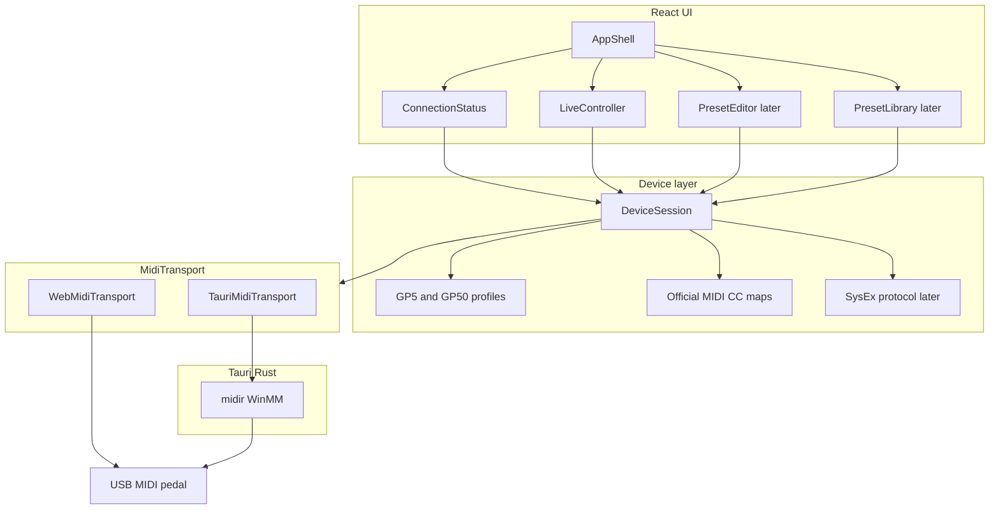

# Valeton: web + Windows (Tauri) + OpenSpec

Plan acordado para el editor/controlador de pedales Valeton GP-5 y GP-50.

El producto habla USB-MIDI con GP-5 y GP-50: fase 1 usa el MIDI CC oficial; editor SysEx y librería/IRs vienen después.

## Stack

- **UI:** Vite + React + TypeScript + Tailwind + shadcn (desde el scaffold)
- **Tema:** dark por default, light opcional (tokens / clase `dark` de shadcn). No es un change aparte: entra en `bootstrap-app`.
- **Shell nativo:** Tauri 2 (instalador Windows ahora; iOS/Android más adelante)
- **MIDI:** interfaz `MidiTransport` con dos backends
  - Browser: Web MIDI (`navigator.requestMIDIAccess`)
  - Desktop/mobile: Rust `midir` vía comandos/eventos Tauri (WebView2 **no** expone Web MIDI)
- **Estado de dispositivo:** capa TypeScript compartida, independiente del transporte
- **Sin backend HTTP.** La app habla directo con el pedal

Electron queda descartado: más pesado y peor camino a mobile. El costo de Tauri es el doble transporte MIDI, que se aísla detrás de una interfaz.

## Arquitectura



La UI nunca llama MIDI crudo. `DeviceSession` conoce el modelo (GP-5 vs GP-50), traduce acciones a CC/SysEx, y el transporte solo envía/recibe bytes.

Connect no es una pantalla: es estado de sesión global. El chrome lo muestra siempre (sin pedal: Connect) y el flujo de conexión ocurre en un modal. Controller es la home.

## Estructura de repo

Un solo app (no monorepo). OpenSpec vive en la raíz, al lado del código.

```text
valeton/
  openspec/
    config.yaml
    specs/
    changes/
  .cursor/               # skills y commands OPSX (openspec init --tools cursor)
  src/
    app/                 # shell React: layout, routing, theme (dark default)
    features/
      connect/           # estado global + modal (no es una página)
      controller/        # home / fase 1
      editor/            # fase 2 (stub)
      library/           # fase 3 (stub)
    device/
      models.ts          # Gp5 | Gp50
      profiles/
      cc.ts              # maps oficiales
      session.ts
    midi/
      types.ts           # MidiTransport
      detect.ts          # elige web vs tauri
      web.ts
      tauri.ts
  src-tauri/             # Tauri 2 + midir
  package.json
```

Perfiles de dispositivo (fase 1, CC oficial):

- **GP-5:** CC 0 patch, 7 volume, 22–25 bank/patch, 48–57 módulos, 58 tuner, 69 CTL
- **GP-50:** lo anterior + master/EXP/BPM/modo Patch|Stomp (CC 1, 11, 13, 17, 19, 21, 28)

Detección: nombre del puerto MIDI USB (Valeton suele aparecer como GP-5 / GP-50). Si hay duda, el usuario elige el modelo.

## OpenSpec

Trabajo spec-driven desde el día 1. No dump de código sin change.

1. `git init` en este repo
2. Instalar CLI (`@fission-ai/openspec`) y `openspec init` con herramienta **Cursor**
3. Completar `openspec/config.yaml` con contexto: Tauri 2, React/TS, MIDI dual, GP-5/GP-50, fases
4. Cada feature = un change: `/opsx:propose` → review → `/opsx:apply` → `/opsx:archive`

Cambios previstos, en orden:

1. **`bootstrap-app`** — scaffold Tauri 2 + Vite/React/TS/Tailwind/shadcn, tema dark default, scripts `dev` / `tauri dev` / `build`
2. **`midi-transport`** — interfaz + Web MIDI + comandos Rust `midi_list_ports` / `open` / `send` + eventos inbound
3. **`device-connection`** — detectar GP-5/GP-50, conectar, estado de sesión (control global + modal, no una ruta)
4. **`live-controller`** — patch, volumen, on/off de módulos, tuner (CC oficial)
5. Más adelante: `preset-editor` (SysEx), `preset-library`, IRs/NAM

Dominios de spec: `midi-transport`, `device-connection`, `live-controller`. El editor y la librería no se especifican hasta su change.

El SysEx de editor/IRs está reverse-engineered en proyectos ajenos (p.ej. editores WebMIDI existentes). **No copiar ese código.** Fase 1 usa solo el MIDI CC publicado en los manuals. Fase 2 se documenta en su propio design.md.

## Fase 1 — lo que se ve

Chrome siempre visible: nombre Valeton, control de conexión a la izquierda, secciones Controller / Editor / Library y tema a la derecha. Controller es la home (`/`). Connect no es una sección: es estado global. Sin pedal el control dice Connect y abre un modal.

Modal de conexión: pedir permiso MIDI, listar puertos, conectar, mostrar modelo. Qué muestra el control cuando hay pedal se define en `device-connection`.

Pantalla Controller: selector de patch 00–99, volumen, toggles NR/PRE/DST/NS/AMP/CAB/EQ/MOD/DLY/RVB, tuner. GP-50 además: master volume y modo Patch/Stomp.

Empaquetado Windows: `tauri build` → instalador NSIS/MSI. Web: `vite` en Chrome/Edge (localhost o HTTPS). Mobile queda fuera de estos cambios; la abstracción MIDI ya lo deja preparado.

## Fuera de alcance ahora

- App mobile Tauri
- Lectura/escritura de presets, rename, reorder
- Upload de IR / SnapTone / NAM
- Bluetooth (algunos GP-5 lo usan; USB-MIDI primero)

## Roadmap

- [x] Init git + OpenSpec (Cursor) y completar `openspec/config.yaml` con el contexto del stack
- [x] Change OpenSpec `bootstrap-app`: Tauri 2 + Vite + React + TS + Tailwind + shadcn, dark default
- [ ] Change `midi-transport`: interfaz `MidiTransport`, Web MIDI y backend Tauri/midir
- [ ] Change `device-connection`: perfiles GP-5/GP-50, detección y sesión (control global + modal)
- [ ] Change `live-controller`: UI de patch/módulos/volumen via MIDI CC oficial
